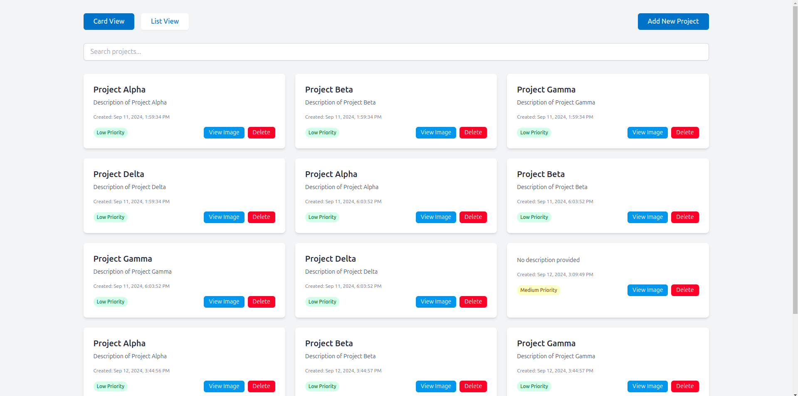

# Front-End Intern Take-Home Test

## Screenshots of the Application



## Overview

Welcome to the Front-End Intern Take-Home Test! Your task is to develop a **simple project management application** focusing entirely on the **frontend** using **Angular** and **Tailwind CSS**. The backend is already set up and ready to use, so your main focus will be building the user interface and connecting it to the backend API ensuring clean code.

### What's Expected:

- You are free to use any UI component library you are already familiar with. If you don’t have a preferred one, feel free to use **Angular Material**, **ng-zorro**, or **PrimeNG**.
- We value **clean and intuitive UI/UX**. A polished, user-friendly interface is a big plus!

## Task Description

Your task is to implement a project management application with the following features:

- **Projects**: Implement functionality to **add**, **delete** with confirmation dialog, and **search** projects. Each project should have:
  - Title
  - Description (optional)
  - Priority (low, medium, high)

### Bonus Challenge

- **Card/List View**: Provide both card and list views for projects, with an option for the user to switch between the two.
- **Dynamic UI Based on Project Properties**: Use properties of project to influence how the UI is displayed.

### Submission Guidelines

- Ensure your application meets as many of the outlined requirements as possible.
- Document any assumptions or decisions you made in the `NOTES.md` file.
- If you are unable to finish all aspects of the test, please still submit what you have completed. We are interested in seeing your approach and understanding your thought process.
- Push your changes to a private GitHub repository and invite us to review it.

## Evaluation Criteria

- **Functionality**: Does the application meet the requirements? What features are implemented?
- **Code Quality**: Is the code clean, well-organized, and easy to maintain?
- **UI/UX**: Is the interface functional, user-friendly, visually appealing, and responsive.
- **Creativity**: We value innovative and creative solutions, particularly in the UI and overall user experience. Bonus points for going beyond the basics and adding thoughtful or unique elements.


## Estimated Completion Time
  We estimate that this test can be completed within 48 hours. While you are not expected to dedicate the full **48 hours** exclusively to working on the test, we are being generous with the timeframe to give you ample opportunity to think through and implement your solution. We kindly ask that you submit your completed solution within this period

*We appreciate the time and effort you put into this test. Good luck!*

## Getting Started

### Prerequisites

- Node.js (LTS version)
- npm (or yarn)
- Docker (for running the PostgreSQL database)
- Git

### Setting Up the Project

1. **Create Your Own Private Repo**

2. **Clone the Repository**

   ```
   git clone [repository-url]
   ```

3. **Add Your Own Repository and Push the Code**

  ```
  git remote add origin [your-private-repository-url]
  git push -u origin main
  ```

4. **Navigate to the Repository**

   ```
   cd [repository-name]
   ```

1. **Install Dependencies**

   ```
   npm install
   ```

1. **Database Setup**

- Set up the PostgreSQL database using Docker:

  ```
   docker-compose up -d postgres
  ```

- Run the database migrations:

  ```
  npx prisma migrate dev
  ```

- Seed the database with initial data:

  ```
  npx prisma db seed
  ```

- **Using Prisma Studio**(optinal if you need to look up in the database):
  Prisma Studio is an intuitive GUI for exploring and manipulating your database. It's an excellent tool for visualizing the data model and managing the data within your database. To use Prisma Studio:

- Start Prisma Studio by running:
  ```
  npx prisma studio
  ```
- Prisma Studio will open in your default web browser.
- Use the GUI to explore your database tables, view records, and even insert or modify data if needed.
- This can be particularly useful for verifying the results of your API operations and understanding the database schema.

5. **Start the Applications**

- Start the NestJS backend:

  ```
  npx nx serve backend-nest
  ```

- In a new terminal, start the Angular frontend:

  ```
  npx nx serve frontend-angular
  ```

6. **Access the Application**

- The frontend application will be available at `http://localhost:4200`.
- The backend API will be running on `http://localhost:3333`.


  